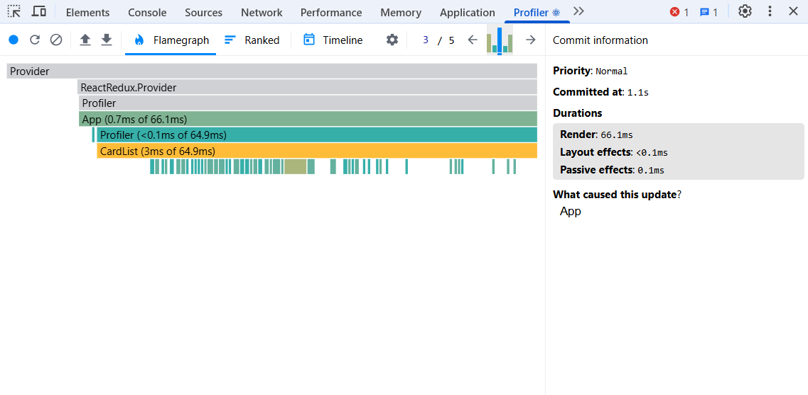
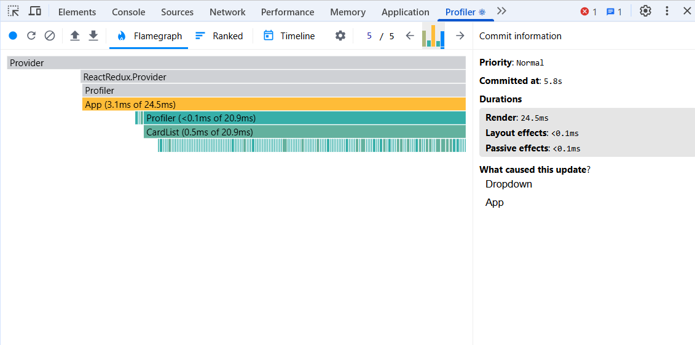
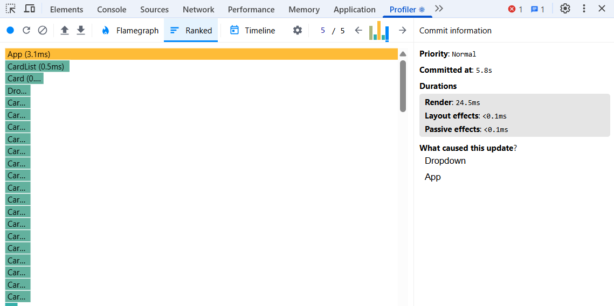
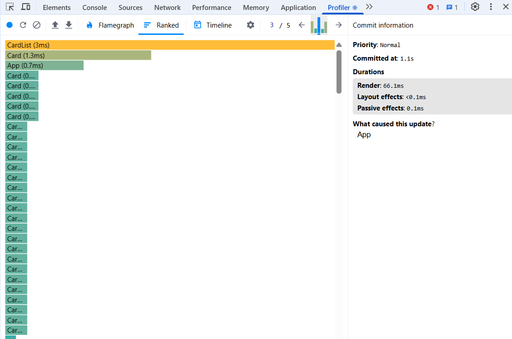
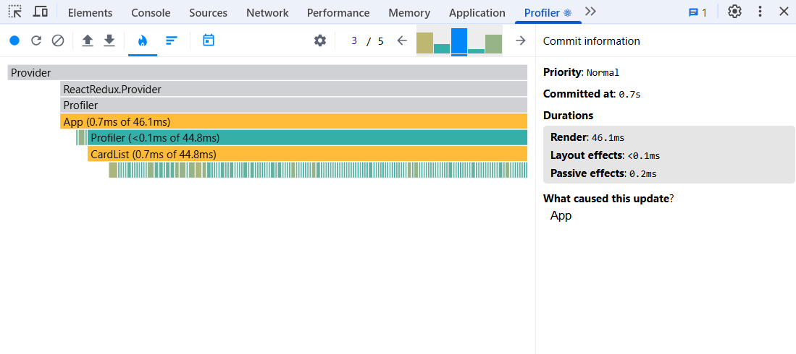
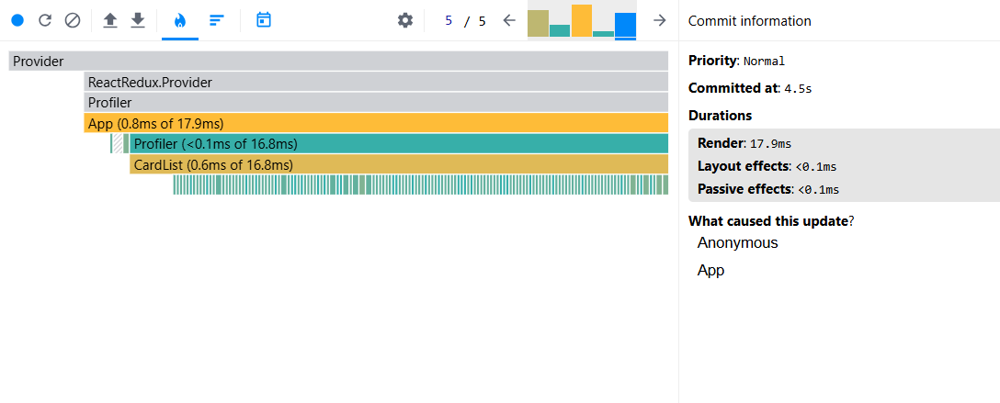
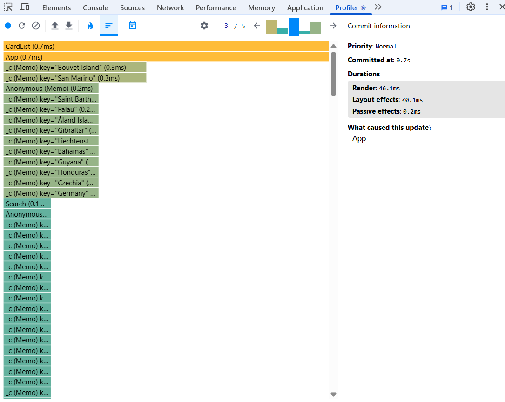
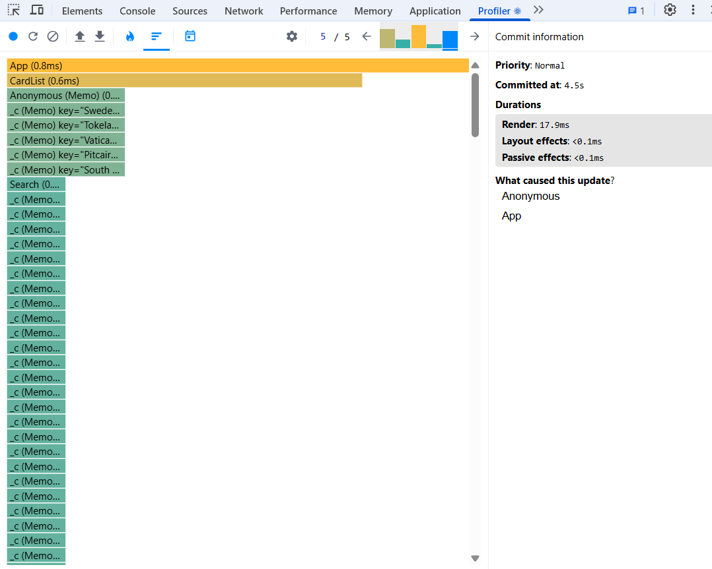

# Results of performance application

## Before optimization

### First Render duration && Commit duration:

- App: 66.1ms && 1.1s
  - Dropdowns: 0.3ms
  - CardList: 64.9ms

### After sorting render duration:

- App: 24.5ms && 5.8s

  - Search: 0.2ms
  - Dropdowns: 0.3ms
  - CardList: 20.9ms

  
  
  
  

## After optimization

### First Render duration && Commit duration:

- App: 46.1ms && 0.7s
  - Dropdowns: 0.4ms
  - CardList: 44.8ms

### After sorting render duration:

- App: 17.9ms && 4.5s

  - Search: 0.6ms
  - Dropdowns: 0.2ms
  - CardList: 16.8ms

  
  
  
  

  ## Conclusion

  The following optimizations were performed:

* Added **_keys_** for Dropdown and CardList for identifying list elements to reuse existing DOM elements when the list changes.
* Added **_useCallback_** for hadlers of filtering, sorting and searching to prevent unnecessary re-renders when passing functions to child components.
* Added **_useMemo_** as well as **_useCallback_** helps preventing unnecessary re-renders but for values.
* Added **_*react.memo*_** for Dropdown and Card to prevent unnecessary re-renders (if changed props).

As we can see from these screenshots, after optimization:

- The first render time was reduced from 66.1ms to 46.1 ms.
- After sortring render time was reduced from 24.5ms to 17.9ms.
- After sorting Dropdown for regions was not re-rendered due to useMemo.
